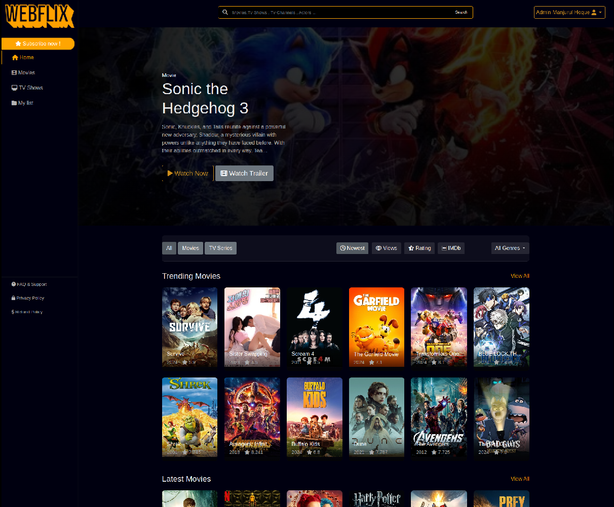
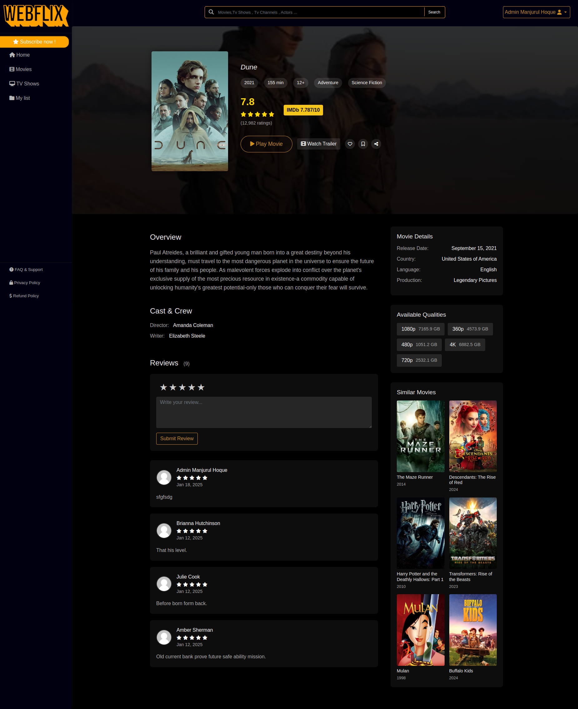
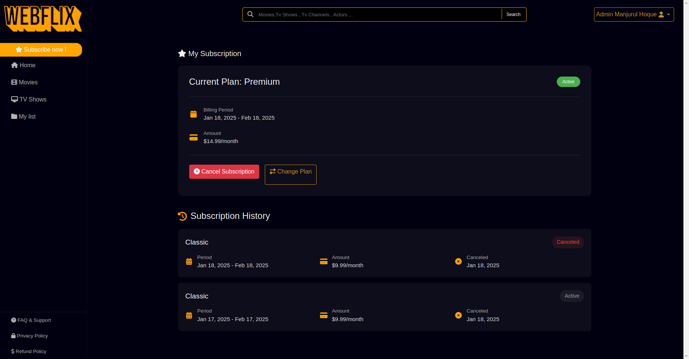
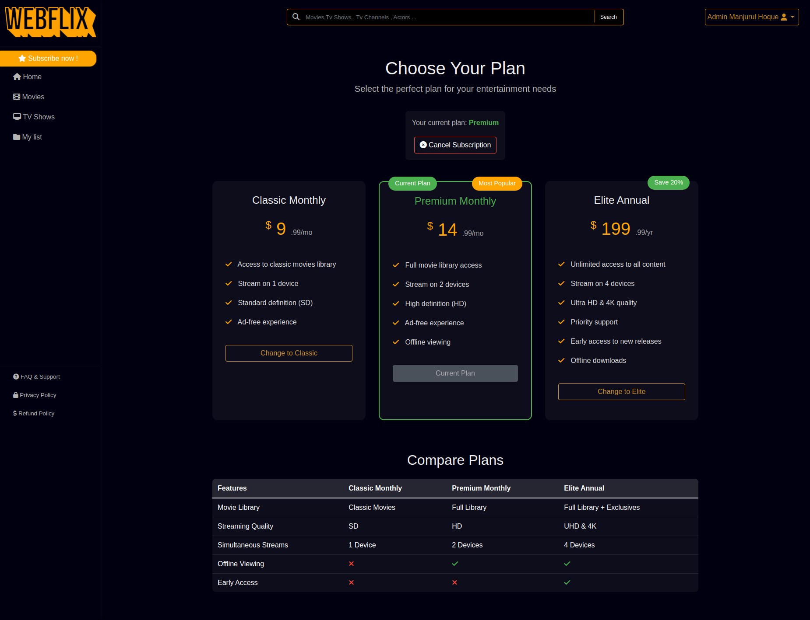

# Django Webflix - Subscription Based Movie Streaming Platform

A Netflix-like streaming platform built with Django that offers subscription-based access to movies and TV series. Users can browse content, manage watchlists, track viewing history, and access premium content through Stripe subscriptions.

Live: [Demo](http://webflix.manjurulhoque.com/)



## Features

### Content Management
- Movies and TV Series catalog
- Genre-based categorization
- Search functionality
- Similar content recommendations
- Content metadata (ratings, descriptions, cast)

### User Features
- User registration and authentication
- Personal watchlists
- Viewing history
- Favorites collection
- User reviews and ratings
- Profile management

### Subscription System
- Stripe integration for payments
- Multiple subscription plans
- Premium content access control
- Subscription management
- Payment history

### Technical Features
- Responsive design
- AJAX-powered interactions
- /// Video quality selection
- /// Progress tracking
- SEO-friendly URLs

## Screenshots

### Movie Details


### User Dashboard


### Subscription Plans


## Installation

1. Clone the repository:
```bash
git clone https://github.com/manjurulhoque/django-webflix.git
cd django-webflix
```

2. Create and activate virtual environment:
```bash
python -m venv venv
source venv/bin/activate # On Windows: venv\Scripts\activate
```

3. Install dependencies:
```bash
pip install -r requirements.txt
```

4. Create .env file:
```
SECRET_KEY=your_secret_key
DEBUG=True
STRIPE_PUBLIC_KEY=your_stripe_public_key
STRIPE_SECRET_KEY=your_stripe_secret_key
STRIPE_WEBHOOK_SECRET=your_stripe_webhook_secret
```

5. Run migrations:
```bash
python manage.py migrate
```

6. Run the development server:
```bash
python manage.py runserver
```

7. Run the development server:
```bash
python manage.py runserver
```

## Stripe Setup

1. Create a Stripe account at [stripe.com](https://stripe.com)

2. Get your API keys from the Stripe Dashboard

3. Create Products and Prices in Stripe(Must be same name):
   - Classic ($9.99/month)
   - Premium ($14.99/month)
   - Elite ($199.99/yearly)

4. Configure Webhook(Optional):
   - Add endpoint: `https://your-domain.com/stripe/webhook/`
   - Select events:
     - `customer.subscription.created`
     - `customer.subscription.updated`
     - `customer.subscription.deleted`

5. Update settings:
```python
STRIPE_PUBLIC_KEY = 'your_stripe_public_key'
STRIPE_SECRET_KEY = 'your_stripe_secret_key'
STRIPE_WEBHOOK_SECRET = 'your_stripe_webhook_secret'
```

## Generate Sample Data
```bash
python manage.py generate_fixtures
python manage.py generate_series
```


## Technologies Used

- Django 5+
- Python 3.11+
- SQLite/PostgreSQL
- Stripe
- Bootstrap 4
- jQuery
- Font Awesome
- HTML5/CSS3

## Contributing

1. Fork the repository
2. Create your feature branch (`git checkout -b feature/AmazingFeature`)
3. Commit your changes (`git commit -m 'Add some AmazingFeature'`)
4. Push to the branch (`git push origin feature/AmazingFeature`)
5. Open a Pull Request

## License

This project is licensed under the MIT License - see the [LICENSE](LICENSE) file for details.

## Acknowledgments

- [Django Documentation](https://docs.djangoproject.com/)
- [Stripe Documentation](https://stripe.com/docs)
- [Bootstrap Documentation](https://getbootstrap.com/docs/)

## Contact

Manjurul Hoque - [@manjurulhoque](https://github.com/manjurulhoque)

Project Link: [https://github.com/manjurulhoque/django-webflix](https://github.com/manjurulhoque/django-webflix)